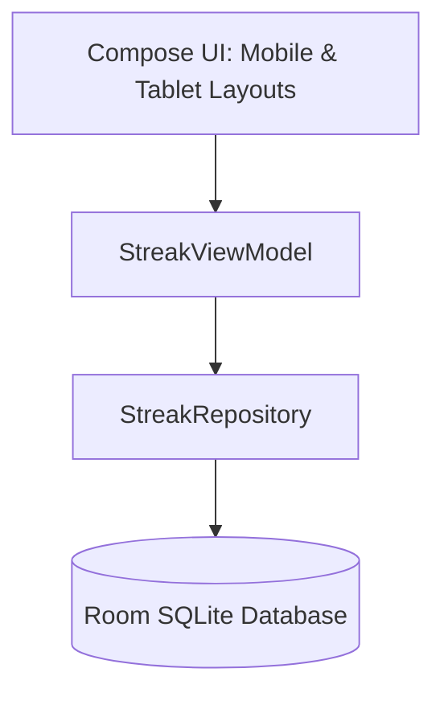

# Architecture & Technical Design - IMyself

This document describes the application architecture, data design, and user interface strategy for the **IMyself – One Day. One Improvement** Android application.

---

## 🏗️ Architectural Pattern
The application follows the modern Android development practices using **MVVM (Model-View-ViewModel)** architecture:



* **UI Layer:** Implemented entirely in **Jetpack Compose** for building a responsive, declarative UI.
* **ViewModel:** Handles UI state (e.g. current streak, target milestone, calendar data state) and processes user events (such as logging a slip or completing a day).
* **Repository:** Serves as the single source of truth for loading and saving streak data, abstracting the local Room database.
* **Database (Room):** Local SQLite storage mapping calendar dates to color states.

---

## 🗄️ Database Design (Room Schema)

To power the color-coded calendar and calculate milestones, we maintain two primary local tables:

### 1. `daily_log` Table
Stores the state of each tracking day.
```kotlin
@Entity(tableName = "daily_log")
data class DailyLog(
    @PrimaryKey val date: LocalDate, // Keyed by date (YYYY-MM-DD)
    val state: LogState,             // Enum: GREEN, YELLOW, ORANGE, RED
    val notes: String?               // Optional text reflection/diary entries
)
```

### 2. `streak_milestone` Table
Keeps track of the user's progress through the Fibonacci milestone progression.
```kotlin
@Entity(tableName = "streak_milestone")
data class StreakMilestone(
    @PrimaryKey(autoGenerate = true) val id: Long = 0,
    val targetDay: Int,             // The Fibonacci target number (e.g., 1, 2, 3, 5, 8, 13...)
    val isLocked: Boolean,          // True if successfully reached
    val dateReached: LocalDate?     // When the milestone was achieved
)
```

---

## 🧮 Fibonacci Logic & Progression

The target tracking states will utilize a helper class to compute milestones:

```kotlin
object FibonacciProgressor {
    // Standard Fibonacci Sequence representation
    val MILESTONES = listOf(1, 2, 3, 5, 8, 13, 21, 34, 55, 89, 144, 233, 377)

    fun getNextMilestone(currentMilestone: Int): Int {
        val index = MILESTONES.indexOf(currentMilestone)
        if (index == -1 || index == MILESTONES.lastIndex) {
            return currentMilestone // Fallback or end of hardcoded array
        }
        return MILESTONES[index + 1]
    }
}
```

### Transition State Machine
1. **Start Milestone:** Initial target is `1`.
2. **Day Completed successfully:**
   - Active streak increments.
   - If active streak matches current target milestone, target milestone is locked (`isLocked = true`) and the next target is computed (`FibonacciProgressor.getNextMilestone(current)`).
3. **Relapse recorded:**
   - Active streak resets to `0`.
   - The target milestone **does not** revert.

---

## 🎨 UI & Responsive Layouts (Mobile & Tablet)
Jetpack Compose handles multi-device scaling automatically using dynamic layout wrappers:

* **Mobile Layout (Compact):**
  - Vertically stacked calendar view.
  - Quick action buttons (Check-In / Log Relapse) at the bottom.
  - Prominent milestone streak ring indicator.
* **Tablet Layout (Medium/Expanded):**
  - Two-pane layout using `BoxWithConstraints` or Window Size Classes.
  - **Left Pane:** Visual calendar grid spanning multiple months.
  - **Right Pane:** Streak progress stats, Fibonacci roadmap view, and daily logging.

---

## ⚖️ Disclaimer Flow Implementation
To ensure compliance with the liability disclaimer, the application implements the following flow:
1. **First Launch (Onboarding):** A fullscreen modal displaying the **Spacecar Disclaimer** and terms of use. The user must scroll through and explicitly check an "I understand and agree" box before entering the app.
2. **About / Settings Screen:** The disclaimer remains accessible at all times in the settings menu.
